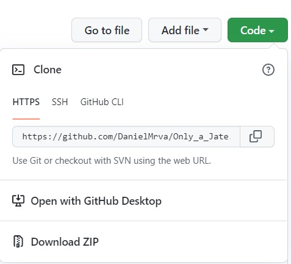
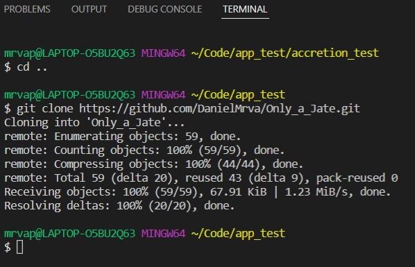
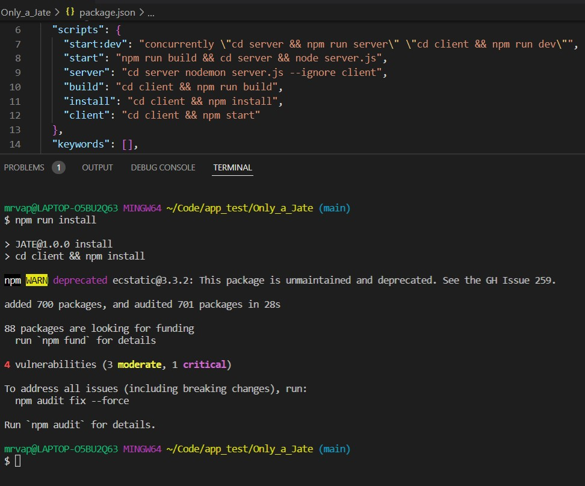
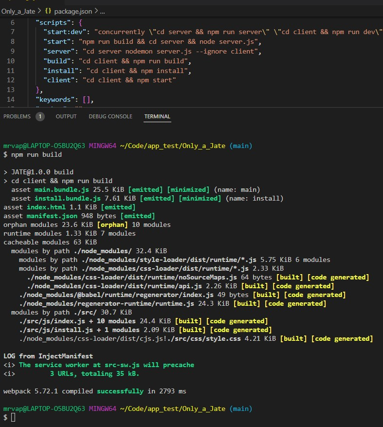
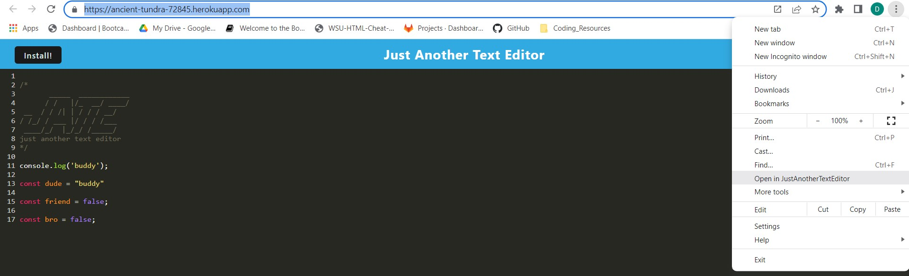
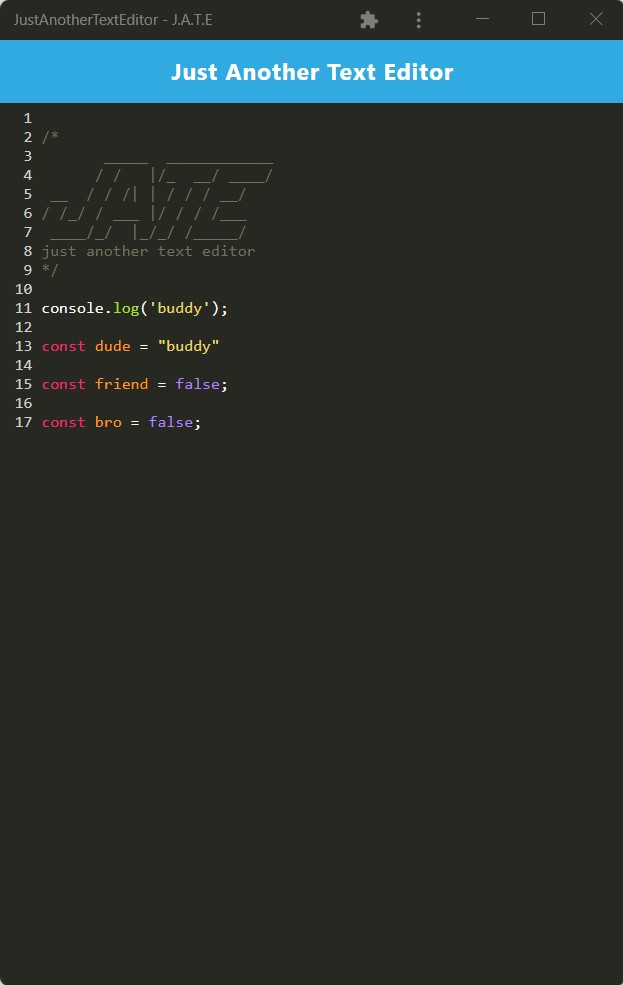

# [Only_a_Jate](https://github.com/DanielMrva/Only_a_Jate) [](https://opensource.org/licenses/MIT)
  
  ## Description
  Only a Jate is just another text editor which provides the ability to write code snipets on the go for later retreival.  The app uses IndexedDB in combination with local storage, cache, and a service worker to allow for offline operation.  Additionally, the app can be installed as a PWA for even easier access.

  ## Table of Conents
   1. [Installation](#installation)
   1. [Usage](#usage)
   1. [Contribution](#contribution)
   1. [Questions](#questions)
   1. [Github Repository](#github-repository)
   1. [License](#license)
  
  ## Installation
  
  To install the app, naviate to the repo page, and copy the link for the repo, and run:

  ```
  git clone https://github.com/DanielMrva/Only_a_Jate
  ```

  To install dependencies, open up the package.json file in the main directory (to use as a reference), and run the script: 

  ```
  npm run install
  ```
  This should install the dependencies; to check, make sure that each package.json file has a matching package-lock.json to accompnay it. If it does not, navigate to the appropriate subdirectory and run:
  ```
  npm i
  ```

  Finally, run the build script: 

  ```
  npm run build
  ```
  This will generate the dist folder for the app.

  

  

  

  
  
  ## Usage 

  To run the app locally, from the command line, run:

  ```
  npm run start:dev
  ```
  This will start both the server and the client for the app.

  The app can be used either from the browser or as a progressive web app (PWA). To install it as a PWA, click on either the Install Button on the left of the window, or select your dropdown menu and click "install jate" (or the equivilant).

  

  

  ## Contribution
  If you have any suggestions, please feel free to email me at my devmail provided on my github profile.  Alternatively, you can fork the repo, modify, and link to your modifications.  Please be specific with the intention, implimentation, and implicaitons of any suggested modifications.
  
  ## Questions
  Please send any questions to my Devmail.

  Feel free to follow or contact me at my GitHub page: [DanielMrva](https://github.com/DanielMrva)
  
  
  ## Github Repository
  [Only_a_Jate-REPO](https://github.com/DanielMrva/Only_a_Jate)
  [Only_a_Jate-DEPLOYED](https://ancient-tundra-72845.herokuapp.com/)

  
  ## License 
  MIT